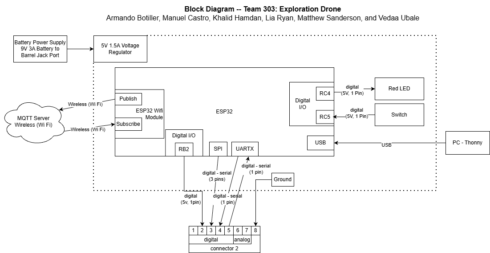

## Overview
This is a breakdown of the parts of the wireless subsystem.
* power levels
* UART connection to sensor subsystem
* SPI connection to motor subsystem
* Digital serial to actuator subsystem
* Power source

To get some initial formatting help, one can view ["here"](https://embedded-systems-design.github.io/EGR304DataSheetTemplate/Appendix/basic-markdown-examples/) some basic techniques.

## Block Diagram of Wireless Subsytem
Here is the block diagram for the wireless subsystem of the Exploration Drone Project.

