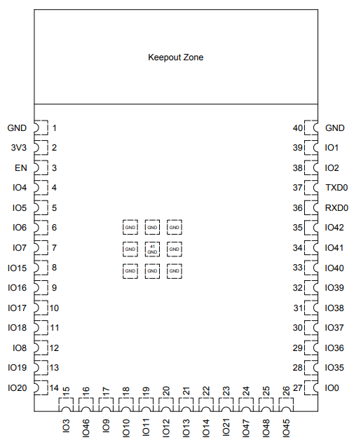

## ESP32

* Easier to program than PIC
* Low power
* High functionality
* Higher clock speed will be able to handle communication between all other subsystems

 | ESP32         | Info                                                                                                 |
 |---------------|------------------------------------------------------------------------------------------------------|
 | Model         | ESP32-S33-WROOM-1-N4                                                                                 |
 | Link          | [Digikey](https://www.digikey.com/en/products/detail/espressif-systems/ESP32-S3-WROOM-1-N4/16162639) |
 | Datasheet     | [Datasheet](https://documentation.espressif.com/esp32-s3-wroom-1_wroom-1u_datasheet_en.pdf)          |
 | Code Example  | [Link](https://randomnerdtutorials.com/esp32-useful-wi-fi-functions-arduino/)                        |
 | Price         | $5.06                                                                                                |
 | Wi-Fi         | IEEE 802.11b/g/n                                                                                     |
 | Frequency     | 2412-2484 MHz                                                                                        |
 | Bit rate      | up to 150 Mbps                                                                                       |

Here is the pin layout of the ESP32:
 

**Subsystem Description**
My subsystem is the wireless control subsystem. The ESP32 was chosen due to the in-built Wi-Fi chip. My susbsystem will also need to coordinate communication between the external human interface and the other subsystems. 
